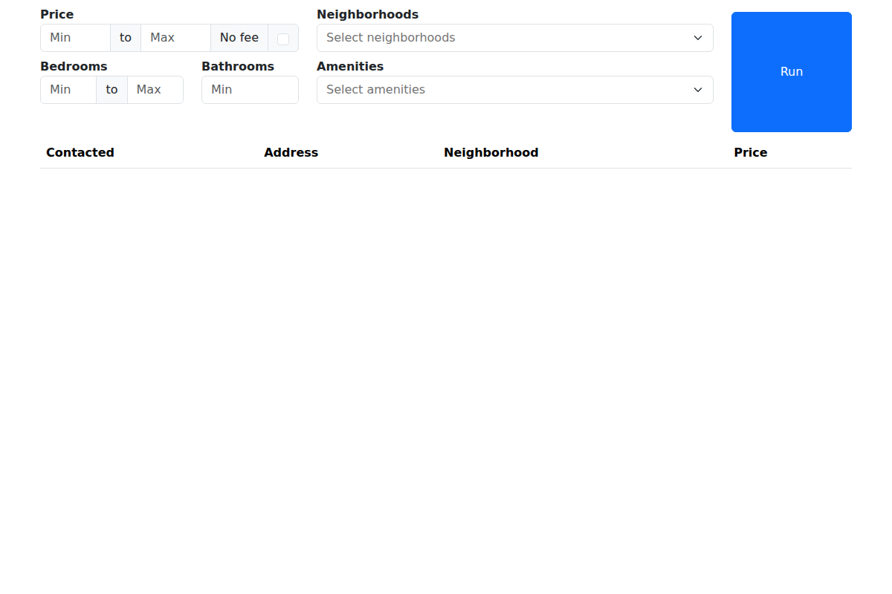

# StreetEasy Monitor
Python script that checks StreetEasy for new rentals matching search criteria and automatically messages new matches.

Includes a Flask application that provides a messaging interface and displays contacted listings, plus optional helper scripts for setting up a cron job to run the script continuously.

### Features
- Uses [Playwright](https://playwright.dev/) with stealth mode to bypass bot detection
- [BeautifulSoup4](https://pypi.org/project/beautifulsoup4/) for HTML parsing
- SQLite database
- Simple web app implemented with [Flask](https://flask.palletsprojects.com/en/3.0.x/), [Flask-WTF](https://flask-wtf.readthedocs.io/en/1.2.x/), [HTMX](https://htmx.org/), [Bootstrap](https://getbootstrap.com/) and [Tom Select](https://tom-select.js.org/)
- Integration with [Paddaddy](https://paddaddy.app/) for added rental info
- Advanced filtering: neighborhood, price range, street number, and description keywords
- Dry run mode to preview listings before sending messages
- Filters out senior housing, income-restricted, and lottery units

### How it works
1. Constructs a StreetEasy URL corresponding to search criteria
2. Scrapes, parses and filters listings from search results page
3. Checks listing descriptions to filter out restricted housing
4. Messages any listings that haven't already been contacted (unless dry run mode)
5. Stores details of newly contacted listings in a database

## Table of Contents
- [Usage](#Usage)
- [Installation](#Installation)
- [Configuration](#Configuration)
- [Important Notes](#Important-Notes)

## Usage

### Command line execution
Run the script using the values in the `defaults` dictionary found in `src/streeteasymonitor/config.py` for the search parameters.
```bash
(.venv) $ python main.py
```

### Run Flask application
The application will run on port 8002 by default (can be changed in `app/app.py`).
```bash
(.venv) $ python -m app.app
```
The application consists of:
- A form that can be used to check for listings based on specified criteria
- A table listing every rental that has been contacted so far, sorted by most recent

**Note:** The Flask form provides basic search options. Advanced filters (street number limits, description keyword filters) are configured in `config.py` and apply to all searches.

When possible, listings link to their corresponding page on [Paddaddy](https://paddaddy.app/), and otherwise link to the original page on StreetEasy.



## Installation
### Clone project
```bash
$ git clone https://github.com/tungcodeforfun/streeteasy-monitor.git
$ cd streeteasy-monitor
````
### (Recommended) Install Python and set up virtual environment using [pyenv](https://github.com/pyenv/)
1. Install Python 3.12.3
```bash
$ pyenv install 3.12.3
```
2. Create virtual environment
```bash
$ pyenv virtualenv 3.12.3 .venv
```
3. Activate virtual environment
```bash
$ pyenv local .venv
```

### Install requirements
```bash
(.venv) $ pip install -r requirements.txt
(.venv) $ playwright install chromium
```

**Note:** The script opens a visible browser window to bypass bot detection. This requires a display (won't work in headless server environments without modification).

## Configuration

### Add message and contact info

Edit the `.env` file to include your desired message, along with your phone number, email, and name. A placeholder file with placeholder values is included in the root directory. All fields are required.
```
MESSAGE='[YOUR MESSAGE]'
PHONE='[YOUR PHONE NUMBER]'
EMAIL='[YOUR EMAIL ADDRESS]'
NAME='[YOUR NAME]'
```
When the script runs, any matching listings will be sent the above information, and an automated email from StreetEasy will be sent to the address you provided indicating that the message has been sent.

*Note: this information is not visible or accessible anywhere other than your local `.env` file.*

### Configure default search parameters and optional filters
Edit `src/streeteasymonitor/config.py` according to your preferences.

#### Search defaults
```python
defaults = {
    'min_price': 0,
    'max_price': 2500,
    'min_beds': 0,        # 0 = studio
    'max_beds': 1,
    'baths': 1,
    'areas': ['East Village', 'West Village', ...],
    'amenities': [],      # e.g., ['pets', 'doorman', 'laundry']
    'no_fee': False,
}
```

#### Dry run mode
```python
dry_run = True   # Preview listings without sending messages
                 # Set to False when ready to send inquiries
```

#### Street filter
```python
max_street_number = 70   # Filter out addresses above 70th Street
```

#### Description filters
Automatically filters out listings containing these keywords:
```python
description_filters = [
    'senior housing',
    'income restricted',
    'minimum income',
    'maximum income',
    '62 years or older',
    'lottery',
    'affordable housing',
    'section 8',
    'hdfc',
    ...
]
```

### Configure cron helper scripts for script scheduling
The `cron` directory contains helper scripts for running the monitor on a schedule.
- `create_cron.sh`: Saves a cron command to `cron.dat`
- `start_cron.sh`: Starts the cron job from `cron.dat`
- `stop_cron.sh`: Stops any active cron job

**Note:** Cron jobs require a display environment since the script uses a visible browser. For headless servers, modify `monitor.py` to set `headless=True` (may trigger bot detection).

## Important Notes
Whenever you send a message on StreetEasy, you will receive an automated email at the address you provide indicating that the listing has been contacted. You will then continue to receive automated messages about any updates to the listing (e.g. price changes, rental status). This means that if you run the script repeatedly, you will have a lot of emails to sort through, so you might want to create a new email address if you don't want to clog your inbox.

## Disclaimer
Users of this software are solely responsible for ensuring their use complies with StreetEasy's Terms of Service and all applicable laws and regulations. This tool is intended for personal, non-commercial use only.

Use of this software is at your own risk. The authors disclaim any responsibility for any misuse or any consequences that may arise from the use of this software.
